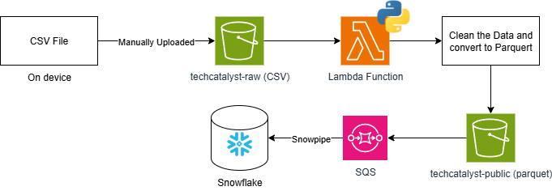

#### Analysis Table:

| **Method**| **Purpose**| **Best Use Cases**| **Pros**| **Cons**|
|-----------|------------|-------------------|---------|---------|
| `upload_file`| Uploads a file from your local system to an S3 bucket.| Large file uploads, simple file transfers.| Handles multipart uploads automatically; retries on failure.| Only works with files on disk; not suitable for in-memory data.|
| `upload_fileobj`   | Uploads a file-like object to an S3 bucket.| Uploading in-memory files (e.g., BytesIO), streaming data.| Flexible with file-like objects; supports multipart uploads.| Requires managing file-like object; less intuitive.|
| `put_object`| Uploads raw bytes or string data to an S3 bucket.| Small files, metadata updates, quick uploads.| Simple and direct; supports metadata| No automatic multipart upload; less efficient for large files.|
| `download_file`| Downloads a file from an S3 bucket to your local system.| Large file downloads, backup tasks.| Handles multipart downloads; retries on failure.| Only works with files on disk; not suitable for in-memory processing.|
| `download_fileobj` | Downloads an S3 object to a file-like object.| Streaming downloads, in-memory processing.| Flexible with file-like objects; good for processing without saving.| Requires managing file-like object; less intuitive than `download_file`.|
| `get_object`| Retrieves an object from S3, returning metadata and a stream of the content.| Reading object content directly, inspecting metadata, partial downloads.| Returns metadata and content stream; supports range requests.| Not ideal for large files; manual handling of stream required.|


#### Reflection Questions:

1. **Upload Methods**:
   - What are the key differences between `upload_file`, `upload_fileobj`, and `put_object`?
   
   `upload_file` uploads an entire file, `upload_fileobj` uploads a file-like object (an object in binary), and `put_object` uploads raw bytes or string data.
   - When would you choose to use `put_object` over `upload_file` or `upload_fileobj`?

   `put-object` would be better for small uploads, but also for additional configureability. According to documentation, it looks like `put-object` just has more features to configure, such as setting the ACL (Access Control List)
2. **Download Methods**:
   - How does `download_file` differ from `download_fileobj` and `get_object`?

   `download_file` downloads a file into the local file system (onto the disk itself). The other two deal with s3 objects in memory.

   - In what scenarios would `get_object` be more beneficial than `download_file`?

   `get_object` would be more beneficial when you want to interact with the stream of the content, rather than the entire file at once.

3. **Efficiency and Performance**:
   - How do multipart uploads and downloads enhance the performance of file transfer operations?

    Multipart uploads and downloads mean that you break a file into multiple pieces before uploading. It increases the performance of file transfer. It also guards against the case that your system crashes mid upload, and you don't lose progress.
   - What are the limitations of using `put_object` and `get_object` for large files?

    No multipart upload means that larger files could have trouble, since you have to load the entire file into memory before uploading/downloading the object. They also weren't built for larger files and will have worse performance.

4. **Practical Applications**:
   - Consider a scenario where you need to upload a large video file to S3. Which method would you use and why?

    I would use `upload_file` because the large video file will be uploaded in multiple parts and automatically retries if there is a failure.

   - If you need to process data in memory before saving it locally, which download method would be most suitable?

    I would use `download_fileobj`.

---

### S3 Client API

> [!NOTE]
>
> Boto3 offers two APIs. One is called **Client API** and another called **Resource API**
>
> * What is the main difference between the two? Document your answer 

Client uses botocore and is lower level. Resource uses a higher level abstraction. 

> ## Why Use `io.BytesIO()` Here?
>
> The primary advantage is **efficiency**. It allows you to handle the file data without performing disk I/O (input/output).

**WHAT IS THIS CODE DOING?**

    This code is taking a csv file, and converting it to a parquet file, sent to techcatalyst-public

```python
import boto3
import awswrangler as wr
from urllib.parse import unquote_plus
import json

def lambda_handler(event, context):
    # Get the source bucket and object name from the Lambda event
    for record in event['Records']:
        source_bucket = record['s3']['bucket']['name']
        source_key = unquote_plus(record['s3']['object']['key'])
    
    print(f'Bucket: {source_bucket}')
    print(f'Key: {source_key}')
    
    input_path = f"s3://{source_bucket}/{source_key}"
    print(f'Input Path: {input_path}')
    
    # Define the destination bucket and key
    destination_bucket = "techcatalyst-public"  # Target bucket name as a string
    
    # Derive the output key (keep same folder structure, replace file extension with .parquet)
    if source_key.lower().endswith('.csv'):
        output_key = source_key[:-4] + ".parquet"
    else:
        output_key = source_key + ".parquet"
        
    output_path = f"s3://{destination_bucket}/{output_key}"
    print(f'Output Path: {output_path}')
    
    # Read the CSV file from S3
    try:
        input_df = wr.s3.read_csv([input_path])
    except Exception as e:
        print("error on read")
        print(e)
        return {
            'statusCode': 500,
            'body': json.dumps('Error reading source CSV file')
        }
    
    # Write the DataFrame to Parquet format in the destination S3 bucket
    result = wr.s3.to_parquet(
		    df=input_df,
            path=output_path,
            dataset=True,
            mode="overwrite"
    )
    
    print("RESULT: ")
    print(result)
    
    return {
        'statusCode': 200,
        'body': json.dumps('CSV file converted to Parquet and moved successfully!')
    }

```


#### Bringing it all together 

* Draw a proposed end-to-end solution diagram that highlights what you can accomplish using the skills you learned in the labs. 


* What are some of the use-cases for this solution? 

    This solution is useful for Storing raw files, storing converted files, and uploading converted files to a data warehouse for storage. 
